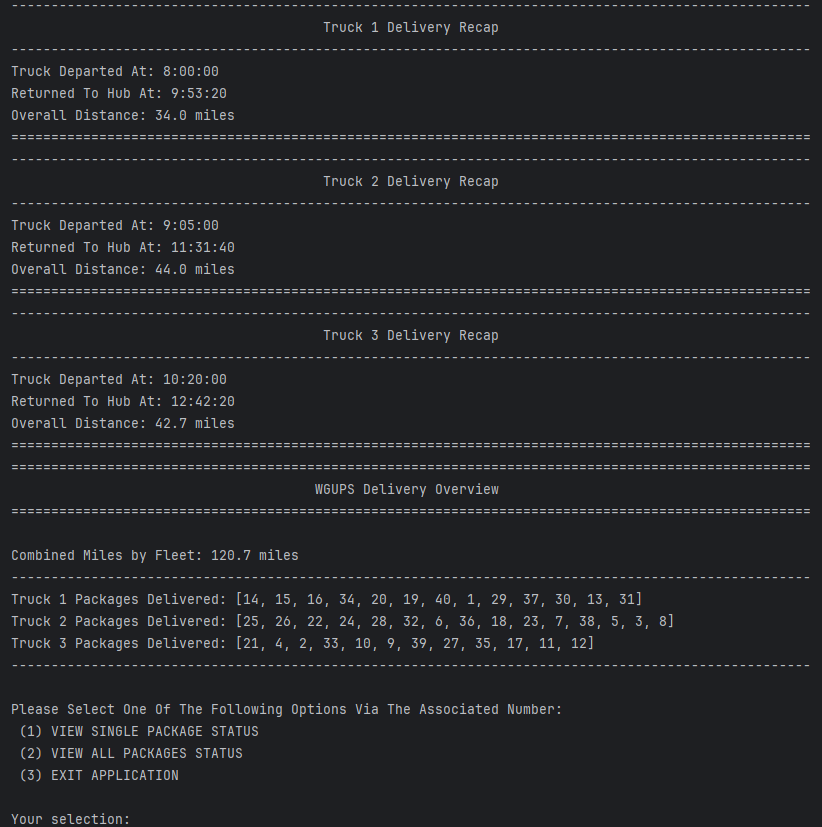
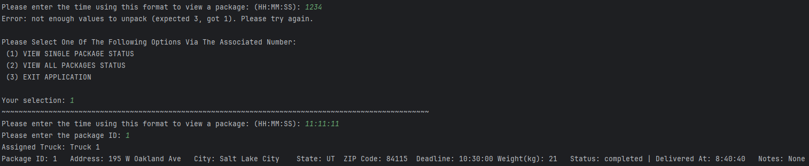
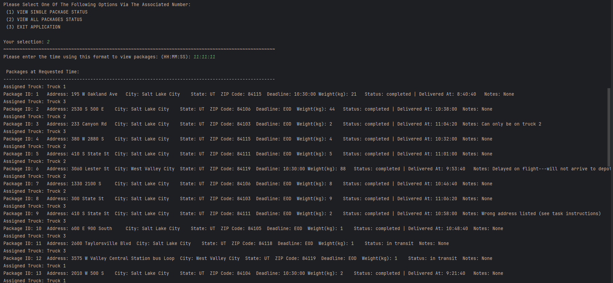
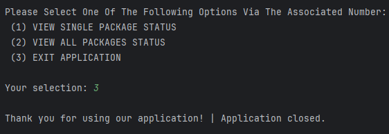

# WGUPS Delivery Management System Simulation

# Overview:

This Python project implements a comprehensive package delivery management system for a simulated organization- WGUPS. It models real-world delivery operations, including data loading, package tracking, truck routing, and user interaction. This system allows for efficient planning of delivery routes, real-time package status checks, and delivery summaries. This application was designed with a focus on solving a real-world logistics problem: optimizing delivery routes for a fleet of trucks, while considering time constraints and mileage limits. The project integrates data structures, file handling, efficient algorithms, and a command-line interface to assist with solving this problem.

# Features:

-	Load package details, distances, and address data from CSV files
-	Assign packages to specific trucks based on load capacity and time-sensitivity deadlines
-	Calculate optimal delivery routes using closest first approach
-	Track package status in-transit, delivered, or at hub based on queried time
-	Summarize truck deliveries, mileage, and schedule reports
-	Keeps the total mileage per fleet to a strict limit of 140 miles
-	Interactive command-line interface for package status inquiries at specific times
-	Clear, organized code structure with modular components for easy scalability, allowing for the addition of more trucks/packages.

# Current Finished Product Images:

### Delivery Overview & Main Menu:

### Option 1 – View Single Package Status Example: 

### Option 2 – View All Package Statuses Example: 

#### Option 3 – Close Application:

## Technologies Used:
-	Python 3.11
-	Provided CSV files for data input
-	Built-in data structures (lists, dictionaries, custom classes)
-	Standard Python libraries (csv, datetime)

# Usage Instructions:

# File Pathway Tree/ File Directory:
Please check the File Pathway Tree File found in this project's repository.

## Installation & Setup:
1.	Download or clone this repository to your local machine.
2.	Ensure Python 3.11 is installed inside of a runnable IDE (Such as PyCharm).
3.	Ensure that the CSV files from the project_resources/ directory is in your working folder as seen in the file paths for this application.
## Running the Program:
1.	After installing and setting up the project, navigate to the project directory through your terminal/IDE.
2.	Run the project using your Python development environment by running the “main.py” file.
3.	The program will automatically load the .csv data file, perform delivery simulations, and then present an interface for the user to use and view.
4.	The interface will display total miles traveled and package delivery summaries. In addition to allowing the user to select from the following options.
-	View the status of a specific package at a specified time.
-	View the statuses of all packages at any given time.
-	Exit the application.
## How It Works:
-	Data is loaded from CSV files into memory structures.
-	Packages are then assigned and delivered using a closest first routing algorithm.
-	Delivery timings and distances are calculated and logged.
-	Users are then able to query package statuses at different points in time to observe progress and completion.
# Contributing:
Contributions are welcome! Feel free to fork the repository, suggest improvements, or add features. Please submit pull requests with clear descriptions of your changes after developing your changes.
